# 🇮🇳 Hindi Transliteration System (Roman → Devanagari)


A comprehensive, deep learning-based system for Hindi transliteration from Roman script to Devanagari. This repository is the complete submission for the **CS772 (Natural Language Processing) Assignment 2**, showcasing the implementation, training, and evaluation of multiple advanced sequence-to-sequence models. The entire project is wrapped in a beautiful, interactive Streamlit GUI with a "Mera Bharat Mahan" theme.

## ✨ Live Demo

[](https://your-streamlit-app-url.com)  <!-- Replace with your Streamlit Community Cloud URL -->

*A live version of the application can be deployed on Streamlit Community Cloud for easy access.*

**GIF of the Application in Action:**


## 🚀 Key Features

-   **Multi-Model Architecture:** Implements and compares three distinct architectures for a comprehensive analysis.
    -   🧠 **LSTM with Attention:** A robust bidirectional LSTM encoder-decoder with both Bahdanau and Luong attention mechanisms.
    -   🤖 **Transformer with Local Attention:** A modern Transformer model where the global self-attention is replaced with a custom **Local Attention** mechanism, focusing on a sliding window of context.
    -   🌐 **Large Language Models (LLMs):** A flexible, multi-provider client for zero-shot transliteration using APIs from **Groq (Llama 3, Mixtral), OpenAI, Anthropic, and Google**.
-   **Stunning Interactive GUI:** A feature-rich Streamlit application for live transliteration, side-by-side model comparison, API configuration, and results analysis, all presented in a custom Indian tricolor theme.
-   **Reproducible & Config-Driven:** The entire project is controlled by a central `config/config.yaml` file. All hyperparameters, model parameters, paths, and training settings are managed in one place for easy experimentation and full reproducibility.
-   **High-Performance Data Pipeline:** The data loader is highly optimized, featuring **bucketed batch sampling** to minimize padding and asynchronous data loading to maximize GPU utilization, resulting in an estimated **30-40% faster training time**.
-   **Rigorous Evaluation:** Implements a comprehensive evaluation suite compliant with the **ACL W15-3902 (NEWS 2015 Shared Task)** standards, including Word Accuracy, Character F1-Score, and MRR.
-   **Automated Error Analysis:** The evaluation pipeline automatically identifies and categorizes common transliteration errors in Hindi (e.g., conjuncts, matras, aspiration), providing deep insights into model weaknesses.

## 🌊 Project Architecture

The project is structured as a modular MLOps pipeline, ensuring a clear and logical flow from data acquisition to final demonstration.

```mermaid
graph TD
    subgraph "1. Data Preparation"
        A[/"📚 Aksharantar Dataset (Hugging Face)"/] --> B(data/download_data.py);
        B -- "Clean & Subsample (100k)" --> C[("train.json, valid.json, test.json")];
        C --> D(utils/data_loader.py);
        D -- "Build on Train Set" --> E[("Source & Target Vocabularies")];
    end

    subgraph "2. Model Training (Config-Driven)"
        E --> F[("PyTorch DataLoaders w/ Bucketing")];
        F --> G(scripts/train_lstm.py);
        F --> H(scripts/train_transformer.py);
        G -- "Save Best Model" --> I[("💾 lstm_best.pt")];
        H -- "Save Best Model" --> J[("💾 transformer_best.pt")];
    end

    subgraph "3. LLM Prompting"
        K(models/llm_model.py) -- "API Calls" --> L{{Groq, OpenAI, Anthropic APIs}};
        L --> M[("LLM Predictions")];
    end
    
    subgraph "4. Evaluation & Analysis"
        N(utils/evaluation.py);
        I -- "Load Checkpoint" --> N;
        J -- "Load Checkpoint" --> N;
        M -- "Get Predictions" --> N;
        C -- "Load Test References" --> N;
        N --> O[("📊 Final Results, Comparison Tables & Error Analysis")];
    end
    
    subgraph "5. Interactive Demonstration"
        P(gui/app.py);
        I --> P;
        J --> P;
        K --> P;
        O --> P;
        P --> Q[("🚀 Streamlit Web App")];
    end
    
    style A fill:#FF9933,stroke:#333,stroke-width:2px
    style Q fill:#138808,stroke:#fff,stroke-width:2px,color:#fff
```



## 📁 Project Structure

The codebase is organized into logical modules for clarity and maintainability.

```
.
├── config/
│   ├── config.yaml           # ⚙️ Central configuration for ALL parameters
│   └── README.md             # 📖 Detailed guide for the config file
├── data/
│   ├── download_data.py      # 📥 Script to download and preprocess Aksharantar data
│   └── ...                   # (Raw and processed data will be stored here)
├── gui/
│   └── app.py                # 🚀 Main Streamlit application
├── models/
│   ├── lstm_model.py         # 🧠 LSTM Encoder-Decoder with Attention
│   ├── transformer_model.py  # 🤖 Transformer with Local Attention
│   └── llm_model.py          # 🌐 LLM client for various providers
├── outputs/
│   ├── checkpoints/          # 💾 Saved model checkpoints (e.g., lstm_best.pt)
│   └── results/              # 📊 Evaluation results, tables, and analysis files
├── scripts/
│   ├── train_lstm.py         # ▶️ Training script for the LSTM model
│   └── train_transformer.py  # ▶️ Training script for the Transformer model
├── utils/
│   ├── data_loader.py        # 📦 PyTorch Dataset, DataLoader, and BucketSampler
│   ├── evaluation.py         # 📈 ACL-compliant evaluation metrics and error analysis
│   └── vocab.py              # 🔤 Vocabulary management class
├── .gitignore
├── README.md                 # You are here!
└── requirements.txt          # Project dependencies
```

## 🔧 Setup and Installation

Follow these steps to get the project running on your local machine.

#### 1. Prerequisites
- Python 3.10 or higher
- `git` for cloning the repository

#### 2. Clone the Repository
```bash
git clone https://github.com/your-username/hindi-transliteration.git
cd hindi-transliteration
```

#### 3. Set Up a Virtual Environment
It is highly recommended to use a virtual environment to manage dependencies.

```bash
# Create the environment
python -m venv .venv

# Activate the environment
# On Windows:
.venv\Scripts\activate
# On macOS/Linux:
source .venv/bin/activate
```

#### 4. Install Dependencies
Install all required Python packages using the `requirements.txt` file.

```bash
pip install -r requirements.txt
```

#### 5. Set Up API Keys (Optional)
To use the LLM transliteration features, you must provide API keys. Set them as environment variables in your terminal.

```bash
# Example for Groq (recommended for its speed and free tier)
export GROQ_API_KEY="your-groq-api-key"

# Example for OpenAI
export OPENAI_API_KEY="your-openai-api-key"

# Other supported keys: ANTHROPIC_API_KEY, GOOGLE_API_KEY, DEEPINFRA_API_KEY
```
> **Note:** You can also add these keys directly in the GUI's "API Config" tab during a live session.Ah, my apologies for the misunderstanding. You want the `README.md` file itself to be a comprehensive user manual, detailing every command-line option and feature you've built into your scripts. That is an excellent idea and a hallmark of a truly polished project.


## ▶️ User Guide: Running the Scripts

This section provides a detailed guide on how to use the command-line scripts for data preparation, model training, and evaluation.

### **1. Data Preparation (`data/download_data.py`)**

This is the first and most crucial step. This script downloads the raw Aksharantar dataset, cleans it, applies the 100k training sample limit, and saves the processed files.

**Basic Usage:**
```bash
python data/download_data.py
```
This command only needs to be run once. On subsequent runs, it will detect that the processed data already exists and skip the process.

**Available Arguments:**

| Argument | Description | Example |
| :--- | :--- | :--- |
| `--config <path>` | Specifies a custom path to the configuration file. | `python data/download_data.py --config config/test_config.yaml` |
| `--force` | Forces the script to re-download and re-process the data, even if processed files already exist. Useful if you change a preprocessing setting in the config. | `python data/download_data.py --force` |

---

### **2. Model Training (`scripts/train_*.py`)**

The `train_lstm.py` and `train_transformer.py` scripts are the core of the project. They handle the entire lifecycle: loading data, building the model, training, validation, checkpointing, and final evaluation. Both scripts share the same set of command-line arguments.

**Standard Workflow (Train, Compare, and Test):**
This is the recommended command to run for a full experiment. It will:
1.  Train the model until convergence (or early stopping).
2.  Save the best model checkpoint to `outputs/checkpoints/`.
3.  Automatically run the "decoding comparison" on the validation set.
4.  Automatically run the final test evaluation using the best checkpoint.

```bash
# To train the LSTM model
python scripts/train_lstm.py

# To train the Transformer model
python scripts/train_transformer.py
```

**Available Arguments & Workflows:**

| Argument | Description | Example Usage |
| :--- | :--- | :--- |
| `--config <path>` | Specifies a custom path to the configuration file. Useful for running experiments with different settings. | `python scripts/train_transformer.py --config config/large_model.yaml` |
| `--wandb` | **(Optional)** Enables logging to Weights & Biases for experiment tracking. Requires a W&B account. | `python scripts/train_lstm.py --wandb` |
| `--test-only` | **(Workflow)** Skips the training phase entirely. It loads the best saved checkpoint (e.g., `transformer_best.pt`) and runs the final evaluation on the test set. Perfect for re-generating results without retraining. | `python scripts/train_transformer.py --test-only` |
| `--compare-only`| **(Workflow)** Skips training and final testing. It loads the best checkpoint and only runs the "Greedy vs. Beam Search" comparison on a subset of the validation data. Useful for quickly analyzing the effect of beam search. | `python scripts/train_lstm.py --compare-only` |

---

### **3. Launching the GUI (`gui/app.py`)**

After training your models, you can launch the interactive web application to see them in action.

**Basic Usage:**
```bash
streamlit run gui/app.py
```

This will start a local web server. Open your browser and navigate to the URL provided (usually `http://localhost:8501`).

The GUI will automatically:
-   Load the best saved `lstm_best.pt` and `transformer_best.pt` checkpoints.
-   Provide an interface to connect to LLM providers.
-   Allow for live transliteration and side-by-side model comparisons.
-   Display final results from the JSON files saved in `outputs/results/`.

---

### ⚙️ Configuration (`config/config.yaml`)

This project is highly configurable. The `config/config.yaml` file is the single source of truth for all parameters. Below are some key settings you might want to adjust for experiments.

**For a Quick Test Run:**
Modify the config to use a very small dataset and few epochs. This is great for verifying that your environment is set up correctly.
```yaml
# In config.yaml
data:
  max_train_samples: 1000 # Use 1k samples instead of 100k
training:
  epochs: 2 # Train for only 2 epochs
```

**To Switch Attention Mechanism:**
You can switch the Transformer from local attention to standard global attention.
```yaml
# In config.yaml
transformer:
  use_local_attention: false # Set to false to use standard MultiheadAttention
```

**To Adjust Decoding:**
Change the beam sizes that will be tested during the evaluation phases.
```yaml
# In config.yaml
evaluation:
  beam_sizes: [1, 5, 10] # Test greedy, beam size 5, and beam size 10
```

For a full guide on every parameter, please see the detailed comments within `config/config.yaml` and the `config/README.md` file.


## ▶️ How to Run the Project

Follow this end-to-end workflow to prepare the data, train the models, and launch the demo.

#### Step 1: Prepare the Dataset
This script downloads the Aksharantar dataset, performs cleaning, and creates the 100k training sample. **This step only needs to be run once.**

```bash
python data/download_data.py
```
The script will create the processed data files in the `data/processed/` directory.

#### Step 2: Train the Models
Train the LSTM and Transformer models using their dedicated scripts. The scripts will automatically handle vocabulary creation on the first run, load the data, train the model, and save the best checkpoint.

*   **Train the LSTM Model:**
    ```bash
    python scripts/train_lstm.py
    ```

*   **Train the Transformer Model:**
    ```bash
    python scripts/train_transformer.py
    ```

> **💡 Tip:** To enable Weights & Biases logging for experiment tracking, add the `--wandb` flag:
> `python scripts/train_transformer.py --wandb`

The best models will be saved to `outputs/checkpoints/lstm_best.pt` and `outputs/checkpoints/transformer_best.pt`.

#### Step 3: Run Final Evaluations (Optional)
The training scripts automatically run a final evaluation on the test set. However, you can re-run this evaluation on a saved checkpoint at any time.

```bash
# Run a full test evaluation (greedy + beam) on the best Transformer model
python scripts/train_transformer.py --test-only

# Compare different decoding methods on the validation set
python scripts/train_lstm.py --compare-only
```
Results will be saved as JSON and Markdown files in `outputs/results/`.

#### Step 4: Launch the Interactive GUI
Once the models are trained, launch the Streamlit application to see them in action!

```bash
streamlit run gui/app.py
```
Navigate to the local URL provided in your terminal (usually `http://localhost:8501`) to access the application.

### ⚠️ Before opening the GUI — quick checklist
Follow these minimal steps to ensure the app loads models and results correctly. Pick the items that apply to your workflow.

- 1) Install dependencies (if not already done):

```bash
pip install -r requirements.txt
```

- 2) Prepare or verify processed data:
    - If you haven't prepared data yet, run the downloader (creates `data/processed/*.json`):

```bash
python data/download_data.py        # or add --force to reprocess
```

    - If you already have processed files or want to skip heavy processing, you can use the included small test decoding file used for GUI demos:

        `outputs/results/quick_decoding_test.json`

- 3) Generate model test results (needed for full Results / Oracle analysis in the GUI):
    - If you have trained models and want up-to-date `decoding` JSONs, run the trainer in test-only mode (PowerShell examples):

```powershell
python scripts/train_transformer.py --config config/config.yaml --test-only
# or
python scripts/train_lstm.py --config config/config.yaml --test-only
```

    This writes `outputs/results/*_test_results.json` (including per-sample `decoding` with per-beam scores) which the GUI will detect and use for the alpha-sweep / reranking features.

- 4) On Windows, ensure UTF-8 output to avoid UnicodeEncodeError when the app prints Devanagari or emoji (optional but recommended):

```powershell
#$env:PYTHONIOENCODING = 'utf-8'
# then launch Streamlit
streamlit run gui/app.py
```

- 5) Launch the GUI:

```bash
streamlit run gui/app.py
```

Notes:
- If you only want to demo the GUI quickly, open the app and pick `quick_decoding_test.json` from `outputs/results` in the Results tab — no training required.
- PPTX export requires `python-pptx` (optional). The GUI disables PPTX features gracefully if the package isn't installed.

## 🔬 In-Depth: Model Architectures

#### 🧠 LSTM with Attention
-   **Encoder:** A 2-layer **bidirectional LSTM** processes the input Roman sequence, creating context-aware representations by reading the sequence both forwards and backwards.
-   **Attention:** A **Luong (multiplicative)** attention mechanism allows the decoder to dynamically focus on the most relevant parts of the source word at each step of the generation process.
-   **Decoder:** A 2-layer unidirectional LSTM generates the Devanagari sequence one character at a time, using the encoder's context and its own previous state.

#### 🤖 Transformer with Local Attention
-   **Architecture:** A standard encoder-decoder Transformer with 2 layers. It uses multi-head attention and position-wise feed-forward networks, with Pre-Layer Normalization for more stable training.
-   **Positional Encoding:** Uses fixed sinusoidal positional encodings to provide the model with information about the order of characters.
-   **Local Attention:** The core innovation for this assignment. Instead of global self-attention, this model uses a custom **Local Attention** mechanism. Each character can only attend to a fixed `window_size` of neighboring characters. This is based on the hypothesis that for transliteration, the most critical context is local, making the model potentially more efficient and focused.

#### 🌐 Large Language Models (Prompting)
-   **Methodology:** This approach uses no training. Instead, it leverages the vast knowledge of pre-trained LLMs by framing transliteration as a reasoning task via **prompt engineering**.
-   **Prompt Structure:** A clear and concise prompt is provided to the LLM:
    -   **System Prompt:** *"You are a Hindi transliteration expert. Convert Roman script to Devanagari script. Provide ONLY the Devanagari transliteration..."*
    -   **User Prompt:** *"Transliterate to Devanagari: {roman_text}"*
-   **Robust Client:** The `llm_model.py` provides a unified client with rate limiting, exponential backoff retries, and response cleaning to reliably interact with multiple different APIs.

## 📈 Evaluation
The models are rigorously evaluated using metrics compliant with the ACL W15-3902 paper and NEWS 2015 Shared Task:
-   **Word Accuracy (Acc):** The percentage of exact top-1 matches.
-   **Character F1-Score:** The harmonic mean of character-level precision and recall, based on the Longest Common Subsequence (LCS).
-   **Mean Reciprocal Rank (MRR):** For beam search, measures the quality of the entire ranked list of predictions.
-   **Mean Edit Distance (MED):** The average Levenshtein distance between predicted and reference words.

-   
## 📑 Official Assignment Report

📄 Full CS772 template-compliant report — results, GUI notes, error analysis:

👉 [CS772 Assignment 2 — Official Report](REPORT.md)


## 📈 Detailed Results & Analysis

📊 Performance charts, linguistic insights, Mermaid graphs:

👉 [Full Results Dashboard](RESULTS.md)


## 🙏 Acknowledgements

- Dataset: **[Aksharantar](https://ai4bharat.iitd.ac.in/)** by AI4Bharat 🇮🇳
- Course: **CS772 — Natural Language Processing**
- Tools: PyTorch, Streamlit, Hugging Face, Weights & Biases, Groq, OpenAI


> ✨ **Maintained with ❤️ by AvinashAnalytics — Building NLP for Bharat.**  
> 🇮🇳 *Mera Bharat Mahan — Let language be no barrier.*
```


